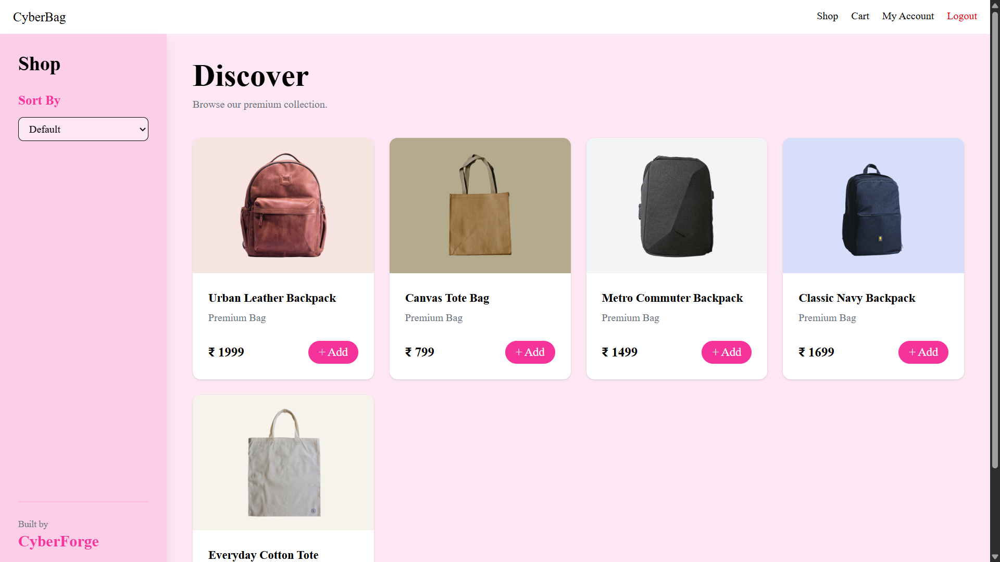
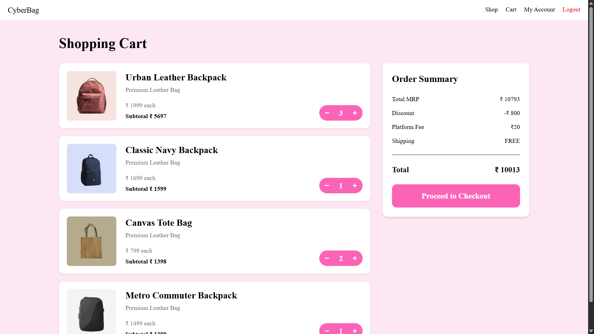
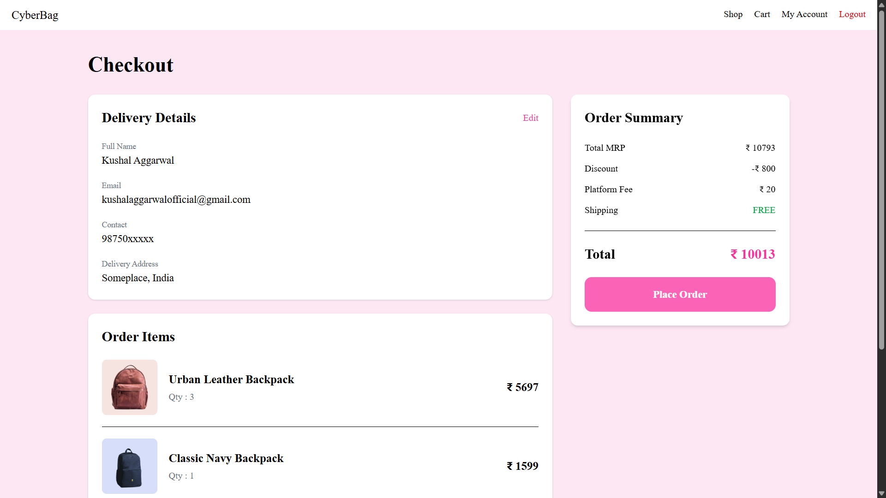
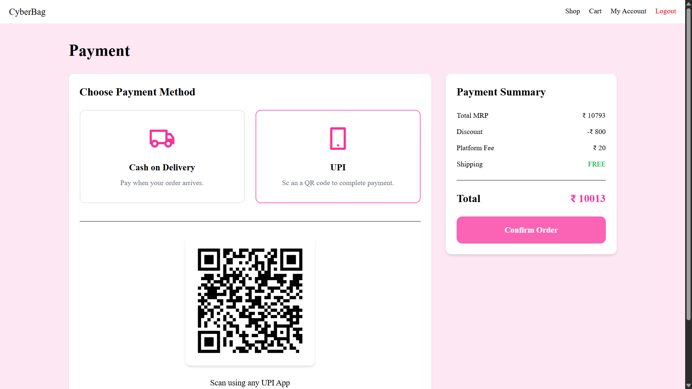
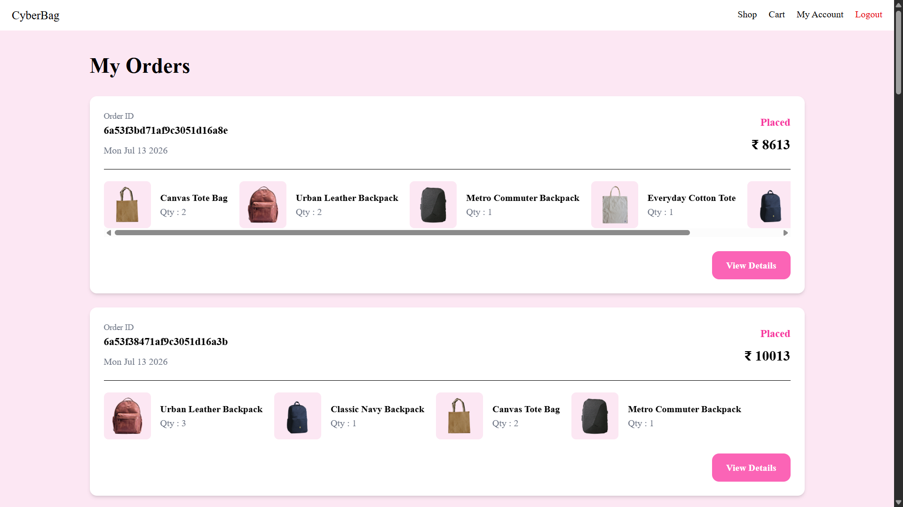
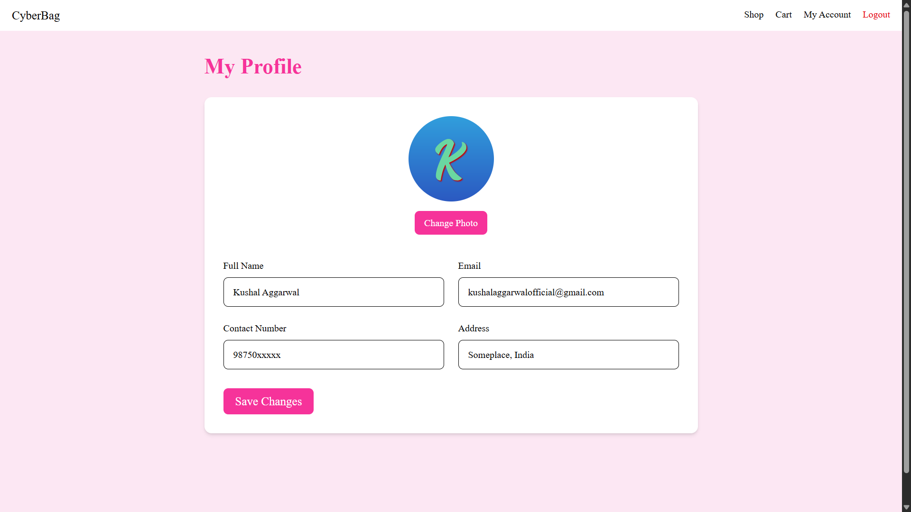
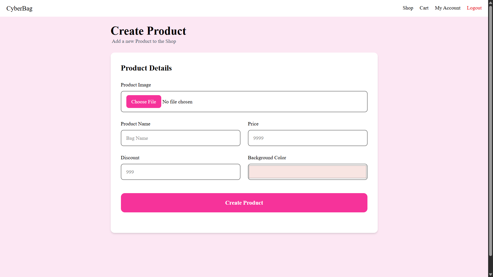

# 🛍️ CyberCarry

CyberCarry is a modern full-stack e-commerce web application built using **Node.js**, **Express.js**, **MongoDB**, **EJS**, and **Tailwind CSS**.

It provides a complete shopping experience including user authentication, cart management, checkout, payment selection, order history, profile management, and automated email notifications.

---

## Features

- 🔐 JWT Authentication
- 👤 User Profile Management
- 🛍️ Product Catalog
- 🛒 Shopping Cart
- ➕ Product Quantity Management
- 💳 UPI & Cash on Delivery (Demo)
- 📦 Order Placement
- 📜 Order History
- 📄 Order Details
- 📧 Customer & Admin Email Notifications
- 🖼️ Product Image Uploads
- 🎨 Responsive UI built with Tailwind CSS
- 🏗️ MVC Architecture

---

## 🛠️ Tech Stack

### Frontend
- EJS
- Tailwind CSS
- JavaScript

### Backend
- Node.js
- Express.js

### Database
- MongoDB
- Mongoose

### Authentication
- JWT
- bcrypt
- cookie-parser

### File Handling
- Multer

### Email Services
- Nodemailer

### Session & Flash Messages
- express-session
- connect-flash

---

## 📁 Project Structure

```text
CyberCarry
│
├── config/
├── controllers/
├── middlewares/
├── models/
├── public/
│   └── images/
├── routes/
├── utils/
├── views/
│   └── partials/
│
├── app.js
├── package.json
└── README.md
```

---

## 🚀 Installation

Clone the repository

```bash
git clone https://github.com/YOUR_USERNAME/CyberCarry.git
```

Move into the project

```bash
cd CyberCarry
```

Install dependencies

```bash
npm install
```

Create a `.env` file in the project root

```env
JWT_KEY=your_jwt_secret

EXPRESS_SESSION_SECRET=your_session_secret

MAIL_ID=your_email@gmail.com
MAIL_PASS=your_app_password
SUPPORT_EMAIL=your_email@gmail.com
```

Start the server

```bash
npm start
```

---

## 📷 Screenshots

### Shop



### Cart



### Checkout



### Payment



### Orders



### Profile



### Admin Page (Create Products)



---

## 💡 Future Improvements

- Product Search
- Product Categories
- Wishlist
- Product Reviews & Ratings
- Razorpay / Stripe Integration
- Admin Dashboard
- Order Tracking

---

## 👨‍💻 Author

**Kushal**

Built by CyberForge using Node.js, Express, MongoDB and Tailwind CSS with Cyber...ness?

## Feedback & Contributions

If you find a bug, have a suggestion, or want to improve the project, feel free to open an issue or submit a pull request.

Carry yourself in style with CyberCarry. <br>
-Kushal Aggarwal

---

## 📄 License

This project is intended for educational and portfolio purposes.